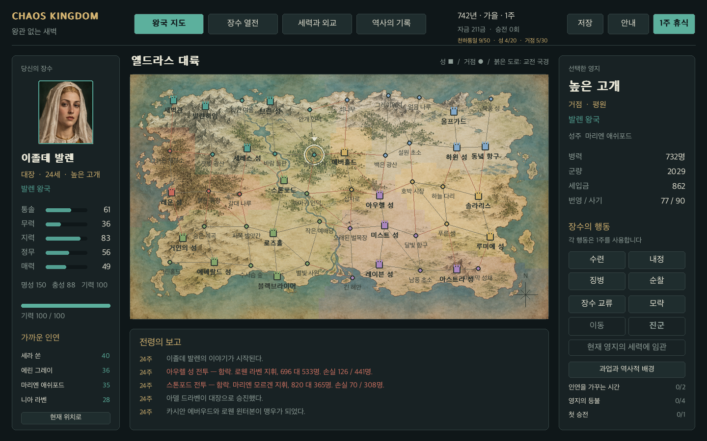

# 혼돈의 왕국 · Chaos Kingdom

가상의 중세 대륙 **엘드라스**에서 장수 한 명의 삶을 플레이하는 PyGame 전략 게임입니다. 200명의 장수, 20개의 성, 30개의 거점, 여섯 세력이 함께 움직입니다. AI가 먼저 진행한 역사에서 캠페인을 시작하고, 내정·인연·전쟁으로 다음 역사를 바꿉니다.

공개 저장소: [centuruk/ChaosKingdom](https://github.com/centuruk/ChaosKingdom) · 기본 브랜치: `main`

현재 버전은 **0.3.0-beta.2 클로즈드 베타 후보**입니다. Mac에서 투명 PNG 뒤에 검은 사각형이 생기던 캔버스 합성 오류를 수정했습니다. 아이소메트릭 공격·방어 지휘, 지역마다 다른 전장 50개와 맵 에디터, 역사와 기억 기반 개인 과업, 천하통일 최종 승리와 96주 중간 연대기, 전투 도중 저장·복구, 로컬 문제 제보를 포함합니다. GPT Image Generator로 200명 초상, 타이틀 배경, 세계지도, UI 장식, 전장 지형과 성벽·성문·다리·부대 이미지 자산을 제작했습니다. 실제 검증과 플랫폼별 확인 범위는 [검증 보고서](docs/evidence/verification.md), 플레이 방법은 [테스터 안내](docs/BETA_GUIDE.md)를 읽어 주세요.



## 바로 실행

처음 내려받은 프로젝트에서는 실행 스크립트가 가상환경을 만들고 필요한 패키지를 설치합니다.

```sh
git clone https://github.com/centuruk/ChaosKingdom.git
cd ChaosKingdom
```

**Mac:** `launch.command`를 더블클릭하거나 아래 명령을 실행하세요.

```sh
./launch.command
```

**Windows:** Python 3.10 이상을 설치하고 `launch.bat`를 더블클릭하세요. 최초 실행은 의존성을 내려받습니다.

새 환경에서는 Python 3.10 이상을 사용합니다. 직접 설치하는 방법:

```sh
python3 -m venv .venv
# Mac
.venv/bin/python -m pip install -r requirements.txt
.venv/bin/python -m chaos_kingdom
# Windows
.venv\Scripts\python.exe -m pip install -r requirements.txt
.venv\Scripts\python.exe -m chaos_kingdom
```

PyGame의 community edition인 `pygame-ce` 2.5.8을 사용하며 코드의 import 이름은 `pygame`입니다. 일반 `pygame`과 `pygame-ce`를 같은 환경에 함께 설치하지 마세요.

## 첫 10분

1. **새로운 이야기 시작 → 왕관 없는 새벽 → 역사 생성**을 선택합니다.
2. 장수의 계급·능력·소속·위치를 읽고 **이 장수로 시작**을 누릅니다. 재야보다 소속 있는 기사·대장이 첫 플레이에 편합니다.
3. 내정과 순찰로 과업을 진행하고, 장수 교류로 친밀도를 올립니다. 행동 한 번에 1주가 흐릅니다.
4. 현재 위치를 기준으로 도로가 연결된 아군 지역을 클릭하고 이동합니다. 붉은 도로가 있는 지역이 교전 국경입니다.
5. 인접한 교전 세력의 영지를 선택하면 **진군**이 켜집니다. 기사 이상, 기력 20, 병력 100, 군량 150이 필요합니다.
6. 전투에서 부대를 좌클릭하고 우클릭으로 이동하거나 공격합니다. Space로 시작·정지하고 돌격·방어·우회를 지시합니다.

먼저 전투 조작만 익히려면 제목 화면의 **전투 연습**을 이용하세요. 연습은 진행 중인 캠페인을 변경하지 않습니다.

| 키 | 기능 |
| --- | --- |
| H | 지휘 안내 |
| Tab | 지도 / 장수 / 외교 / 연대기 전환 |
| Space | 전략 화면에서 1주 휴식, 전투에서 정지·재개 |
| F5 / F9 | 저장 / 불러오기 |
| Esc | 안내 닫기, 전략 화면에서 메뉴, 전투에서 철수 확인 |
| A / 1~5 | 전투에서 전 부대 / 개별 부대 선택 |
| Shift + 좌클릭 | 부대 다중 선택 |
| 우클릭 | 선택한 부대 이동, 적 부대 공격 |

전략 행동 후와 전투 10초마다 자동 저장됩니다. 전투 중 F5로 저장할 수 있고 불러온 전투는 일시정지 상태로 이어집니다. 직전 정상 저장은 백업으로 보존합니다. 소스 실행은 `saves/campaign.json`, 배포 앱은 OS의 사용자 데이터 폴더에 저장합니다. `CHAOS_KINGDOM_HOME`으로 위치를 지정할 수 있습니다.

## AI와 캠페인

성격(야망·명예·공감·용기), 능력, 기력, 영지 상태, 인연, 최근 패전 기억을 이용한 **효용 기반 AI**입니다. 판단 이유는 장수 열전에서, 실제 경험은 **이 장수의 기억 읽기**에서 확인합니다. 외부 AI 서비스나 API 키가 필요하지 않습니다.

기본 캠페인은 서로 다른 시드로 24주·72주·120주의 역사를 진행한 결과입니다. 전투, 승진, 교류, 모략, 귀순, 외교가 연대기에 남습니다. 같은 시드와 코드 버전은 같은 출발점을 재현합니다.

```sh
# GUI 없이 2년의 역사 생성, 저장과 보고서 출력
.venv/bin/python -m chaos_kingdom campaign --seed 742 --weeks 96 --title "왕관의 계절" --output exports/campaign.json --report exports/report.json

# 생성한 역사를 게임으로 열고 장수 선택
.venv/bin/python -m chaos_kingdom play --load exports/campaign.json --view select

# 다섯 세계의 5년 판세를 비교
.venv/bin/python -m chaos_kingdom balance --seeds 5 --weeks 240 --output exports/balance.json

# 저장 검증 / 환경 진단
.venv/bin/python -m chaos_kingdom inspect exports/campaign.json
.venv/bin/python -m chaos_kingdom doctor
```

## 책과 제작 도구

개발서 **『200명의 의지를 설계하다』**를 설계·구현과 함께 작성합니다. 원고는 [docs/book](docs/book/README.md), 읽기용 편찬본은 [docs/book.html](docs/book.html)입니다. 결정 이유, 실제 수식과 소스 위치, 실패와 수정, 검증 결과, 다음 실습을 포함합니다.

```sh
.venv/bin/python tools/build_book.py
.venv/bin/python tools/export_campaign.py --seed 742 --weeks 96 --output exports/realm
.venv/bin/python tools/content_check.py
.venv/bin/python tools/capture_screens.py
```

## 구조와 검증

```text
chaos_kingdom/
  core/         데이터 모델, 세계·캠페인 생성, 저장과 검증
  simulation/   장수 판단 AI, 주간 전략 엔진, 전술 전투
  ui/           PyGame 화면, 지도와 초상, 입력과 상태 전환
  data/         수정 가능한 왕국·세력·이름 콘텐츠
tools/          앱 빌드, 역사 내보내기, 콘텐츠 검사, 화면 촬영, 책 편찬
tests/          시뮬레이션·저장·전투·화면 연결 검증
docs/book/      개발서 원고
docs/evidence/  실제 검증과 밸런스 보고서
```

```sh
.venv/bin/python -m pip install -e '.[dev]'
.venv/bin/python -m pytest -q
.venv/bin/python tools/build.py
```

빌드는 실행한 OS용으로 생성합니다. Mac은 `dist/ChaosKingdom.app`, Windows는 `dist/ChaosKingdom/ChaosKingdom.exe`입니다. Windows·Mac 테스트와 빌드를 위한 GitHub Actions 설정도 있습니다. 로컬 검증 범위와 실행 결과는 [검증 기록](docs/evidence/verification.md)에 남깁니다. Windows 실행은 Windows에서 별도 검증해야 합니다.

한글은 Mac의 Apple SD Gothic Neo, Windows의 맑은 고딕을 우선 사용합니다. 다른 폰트는 `CHAOS_KINGDOM_FONT`에 TTF/TTC 파일 경로를 지정하세요.

## 베타의 전장 편집기

메인 메뉴의 전장 편집기에서 50개 지역을 골라 지형과 출진 위치·중앙 거점을 바꿉니다. 칠하기, 되돌리기·다시 하기, 연결 검증, 저장·불러오기, 원본 복원, 시험 전투를 지원합니다. G키 또는 격자 버튼으로 판정 칸을 표시·숨길 수 있습니다. 숲·바위·강·지면은 이어지는 평면 재질로 표시하며 높이차 규칙은 없습니다. 편집본은 사용자 저장 폴더에 기록하며 캠페인 세계와 연습 전투는 분리되어 있습니다.

```sh
.venv/bin/python -m chaos_kingdom play --view editor
.venv/bin/python -m chaos_kingdom validate-maps
.venv/bin/python tools/beta_audit.py
.venv/bin/python tools/agent_catalog.py
.venv/bin/python tools/replay_report.py saves/reports/제보파일.zip --output exports/reproduction
```

## 개발 원고와 에이전트 구성

[개발 원고](docs/book.html)는 설계·구현·실험에 이어 에이전트 구성, 게임 AI와 생성 AI의 활용 방향, GPT Image 자산 생산, 전장 편집기, 베타 저장·검증을 다룹니다. [역할 계약](docs/production/agents.json)은 다음 작업에서도 사용할 입력·산출물·완료 기준을 정의합니다. 실제 이번 제작은 주 개발 에이전트 하나가 진행했고, 별도 전문 에이전트를 실행했다고 기록하지 않습니다.

생성 프롬프트·원본 출처·200개 초상 주소는 `chaos_kingdom/assets/manifest.json`에 있습니다. 게임 플레이에는 외부 언어 모델이나 이미지 생성 서비스 호출이 없습니다.

## 베타 묶음 만들기

대상 OS에서 `tools/build.py`를 실행하고 실제 앱을 확인한 뒤 `tools/package_beta.py`로 소스·원고와 Mac 앱을 묶습니다. 저장 파일과 개인 제보, 가상환경은 배포 묶음에 넣지 않습니다. Windows 네이티브 빌드는 Windows CI나 실제 Windows PC에서 수행해야 합니다.

`tools/verify_release.py`는 배포 ZIP의 손상과 콘텐츠를 검사하고, Mac에서는 임시 폴더에 풀어 실행 권한·프레임워크 링크·전장 및 화면 실행을 확인합니다. `releases/SHA256SUMS.txt`는 최종 배포 파일의 체크섬입니다.

제작 에이전트와 실제 사용한 스킬·도구는 [개발 에이전트 원고](docs/book/13-development-agents.md)와 [실행 명세](docs/production/workflow-tools.json)에 기록합니다. 역할 계약과 실제 실행을 구분합니다.
