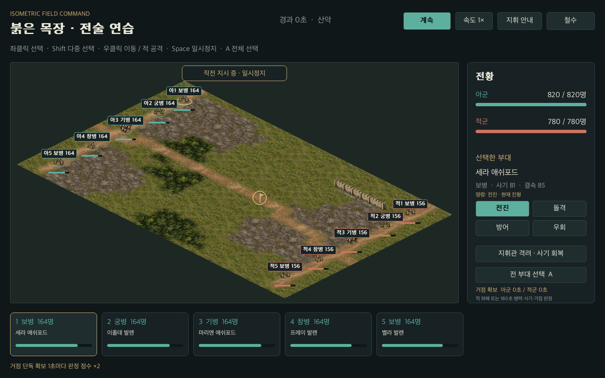
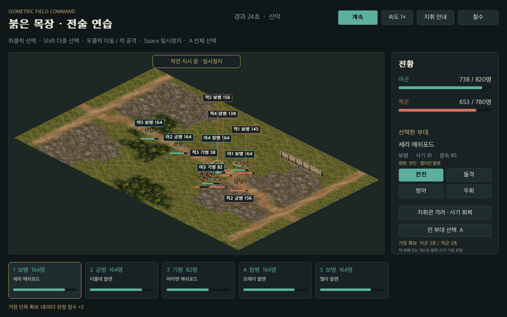
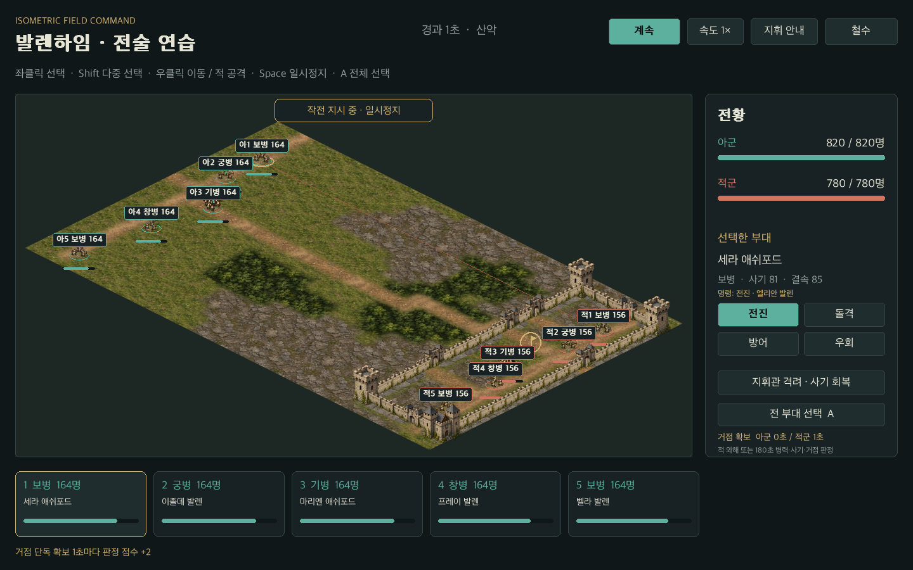

# 6장. 1,000명의 전장

## 규모는 개인 병사의 수가 아니다

전장에는 각 측 최대 다섯 부대가 있다. 병사 한 명씩 이동과 공격을 계산하지 않고 부대를 하나의 개체로 표현한다. 부대는 병종·지휘 장수·좌표·병력·사기·결속·명령·목표를 가진다. 초기 UI의 점 표현은 GPT Image Generator로 만든 아이소 부대 그림으로 바뀌었다. 그림 속 병사는 부대의 시각 표현이며 개별 AI가 아니다.

공격군은 출발 영지 주둔군의 82%를 투입하고 나머지는 수비로 남긴다. 수비군은 대상 영지의 주둔군을 사용한다. 각 영지 병력 상한이 1,000이고 전장 초기 편성도 이를 제한한다. 적은 전력을 다 투입하고 공격자는 일부를 남기므로 단순한 병력 우세만으로 모든 성을 쉽게 빼앗지 못한다.

## 일시정지 가능한 실시간을 선택하다

전투는 일시정지로 시작한다. 사용자는 부대를 선택하고 이동·공격·돌격·방어·우회를 지시한 뒤 시간을 흐르게 한다. 계산은 0.2초 단위로 진행된다. 화면의 프레임 시간은 누산기에 들어가고 충분한 시간이 쌓였을 때 고정 간격 계산을 실행한다.

이것은 참고 작품의 정확한 턴 규칙을 복제한 전투가 아니다. 지휘에 집중하는 경험을 작은 PyGame 프로젝트에서 전달하기 위해 선택한 자체 방식이다. 빠른 반사 신경보다 병종과 위치, 명령과 사기의 이해를 보상하고 싶었다.

## 병종 네 가지

| 병종 | 이동 속도 | 공격 사거리 | 주된 특징 |
| --- | --- | --- | --- |
| 보병 | 3.2 | 3.2 | 기본적인 균형 전력 |
| 궁병 | 2.6 | 19.0 | 원거리 공격, 근거리 화력 감소 |
| 기병 | 5.1 | 3.8 | 빠른 이동과 강한 공격, 창병에 취약 |
| 창병 | 2.8 | 3.5 | 높은 방어와 기병 견제 |

단위는 게임 전장 좌표다. 기병이 창병을 공격하면 배율이 0.48, 창병이 기병을 공격하면 1.6이 된다. 숲과 바위 지대는 이동을 늦추고 방어 효과를 준다. 도로는 이동을 빠르게 하고, 물과 성벽은 통과할 수 없다. 강은 연결된 다리로 건넌다.

0.1에서는 지역별 배율과 강의 좌표 조건만 사용했다. 베타에서는 32×20 타일의 실제 통행 데이터와 A* 경로 탐색으로 바꿨다. 그림과 규칙은 같은 타일 코드를 읽는다. 궁병의 사선은 성벽과 연속된 숲을 검사한다. 도달할 수 없는 섬을 클릭했을 때 부대가 물 위로 직진하지 않도록 경로가 없으면 제자리에 머문다. 파일 형식과 편집 검증은 16장에서 다룬다.

## 병력이 화력으로 바뀌는 과정

피해의 기본량은 다음 요소의 곱이다.

```python
피해 = 시간간격 * (병력 ** 0.65 / 8)
     * 병종 공격력 * (0.65 + 지휘 능력)
     * (0.45 + 사기 / 100)
     * 상황 배율 / 상대 방어력
```

병력에 0.65의 지수를 써서 병력 두 배가 화력 두 배로 곧장 이어지지 않게 한다. 지휘 능력에는 통솔·무력·지력이 들어가고 특기 병종에는 보너스가 붙는다. 돌격은 화력을 올리지만 사기를 소비한다. 방어 명령은 받는 피해를 줄인다. 요새 방어는 수비군의 방어 배율에 들어간다.

후방 공격은 상대의 바라보는 방향과 공격자 방향의 각도로 판정한다. 후방의 근접 공격은 추가 피해와 사기 압박을 만든다. 우회 명령은 전장 위쪽이나 아래쪽으로 이동한 뒤 접근하도록 한다. 정교한 기동 계획보다는 명령의 차이를 플레이어가 확인할 수 있는 첫 구현이다.

## 동시에 피해를 적용한다

부대를 순회하면서 바로 상대 병사를 줄이면 목록 앞쪽 부대가 유리해질 수 있다. 그래서 각 부대가 만들 피해와 압박을 먼저 누적하고, 마지막에 모든 부대의 피해를 반영한다. 순서에 의한 편향을 줄이는 장치다.

사기가 13 미만이거나 병력이 초기의 13% 아래로 내려가면 부대는 와해된다. 와해한 병력은 활동하지 않지만 남은 인원은 살아남은 병력에 포함된다. 지휘관 격려는 35초마다 활동 중인 아군의 사기를 16 올린다.

## 끝나지 않는 전투를 막는다

한 측의 활동 부대가 사라지면 상대가 승리한다. 180초가 지나도 끝나지 않으면 남은 활동 병력과 사기, 중앙 거점 확보 시간을 반영해 전황을 판정한다. 사용자는 철수할 수도 있다. 경계 시간은 수백 시드의 역사 생성이 하나의 전투 때문에 멈추는 일을 막는다. 고정 간격 때문에 마지막 기록은 180.2초까지 나올 수 있다.

전투가 끝나면 전략 엔진은 공격군의 생존 병력을 복귀·점령군으로 나누고 수비군의 남은 병력을 갱신한다. 함락된 수비대의 잔존 전력은 해산된 것으로 처리하며 지역 장수는 남은 소속 영지로 옮긴다. 지휘관의 명성, 승전·패전 기억, 동료들의 관계도 변한다. 이미 반영한 전투 객체는 다시 반영할 수 없도록 표시한다.





실습: 같은 전장으로 전진·돌격·방어를 각각 지시해 병력과 사기의 변화 곡선을 비교해 보자. 서로 다른 전장의 최종 승률보다 같은 조건에서 한 명령만 바꾼 실험이 효과를 설명하기 쉽다.

## 단차 없는 아이소 시점과 성곽

현재 전투는 2:1 아이소메트릭 시점이다. 높이 좌표나 고저차 피해는 없다. 재질은 평면 바닥에 이어지고, 성벽·성문·탑·다리·성채는 투명 이미지로 서 있는 건축물을 표현한다. 성벽은 통행과 사선을 막고 성문은 통행 가능·이동 배율 0.90·엄폐 배율 1.15다. 다리는 도하 경로다. 건축물과 부대는 x+y 깊이 순으로 함께 그려 앞뒤를 표현한다.



집단 이동 명령은 같은 점을 다섯 부대에 복사하지 않는다. 목표 주변의 연결된 통행 칸을 나눠 목적지를 배정한다. 활동 부대가 겹치면 아군 중심 간 2.4, 적군 간 1.8의 거리로 밀림을 완화한다. 벽·물 때문에 충분히 비킬 수 없는 곳도 있으므로 개별 병사의 정밀한 충돌이나 완전한 대형 시스템이라고 쓰지 않는다. 각 밀림과 경로 이동은 지나가는 칸 전체를 검사한다.

수비 AI는 전장의 끝에서 적을 기다리는 대신 거점 주변의 역할별 위치로 재배치한다. 궁병은 거리를 유지하고 창병은 접근한 기병을 견제하며 기병은 상황에 따라 우회를 시도한다. 자동 판단은 4초마다 갱신한다. 직접 지휘하는 편의 명령은 자동 판단이 덮어쓰지 않는다.

180초 판정의 실제 식은 활동 부대마다 `병력 × (0.4 + 사기/100)`을 합하고 거점 단독 확보 초마다 2점을 더한 것이다. 동점은 수비 승리다. 거점을 확보한 순간 전투가 끝나지는 않는다. 화면에 명령·목표와 거점 시간의 의미를 표시한 이유는 실제 플레이에서 이 규칙을 오해하기 쉬웠기 때문이다.
