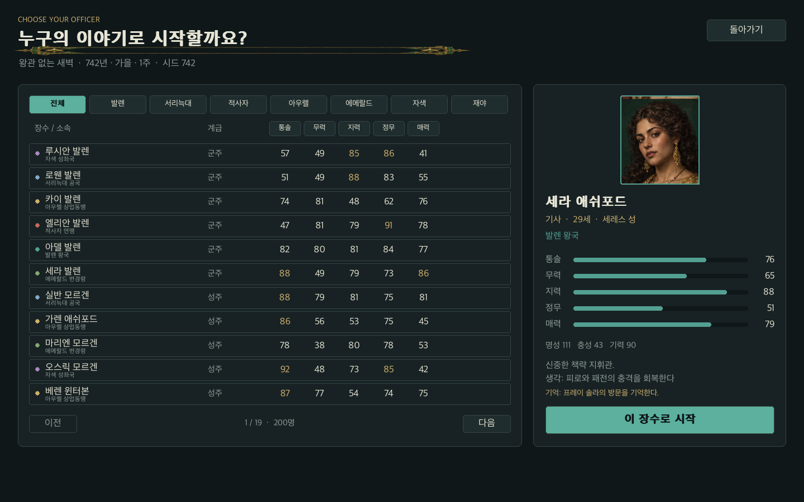

# 8장. 플레이어가 읽을 수 있는 화면

## 화면마다 하나의 질문을 둔다

제목 화면은 어떤 경험인지 설명한다. 캠페인 화면은 얼마나 진행된 역사에서 시작할지 묻는다. 장수 선택 화면은 누구의 삶을 플레이할지 묻는다. 지도는 지금 어디에 있고 어디로 갈 수 있는지 보여준다. 장수 열전은 능력과 판단 이유를, 외교는 세력 관계를, 연대기는 일어난 일을 보여준다.

하나의 화면에 모든 숫자를 넣는 대신 필요한 순간에 필요한 질문에 답하게 한다. 그러나 장수의 위치, 기력과 명성은 전략 화면에서 계속 볼 수 있게 왼쪽 패널에 고정한다. 영지를 선택해도 플레이어 자신이 누구인지 잃지 않게 하기 위해서다.

## 지도와 정보의 역할을 나눈다

지도는 양피지 색의 대륙과 색이 다른 영지, 도로와 지역 아이콘으로 그린다. 성은 성채 아이콘, 거점은 작은 원이다. 선택 지역은 금색 테두리, 플레이어 위치는 밝은 이중 원과 표식으로 구분한다. 교전하는 세력 사이 도로는 붉게 표시한다.

지도는 지리적 관계를 보여주고 오른쪽 영지 패널은 정확한 수치를 보여준다. 작은 지도 위에 병력·군량·사기·관리자·소유 세력을 전부 쓰지 않는다. 자원은 패널에서 읽고 다음 행동 버튼도 그 아래에 둔다.

## 고정 논리 해상도와 창 크기

모든 화면은 1440×900의 논리 캔버스에 그린다. 실제 창은 기본 1280×800이며 사용자가 크기를 바꿀 수 있다. 캔버스는 종횡비를 유지해 맞춰 그리고 남는 공간은 배경으로 채운다. 마우스 좌표를 논리 캔버스 좌표로 되돌려 같은 버튼 판정을 사용한다.

이 방식은 매 화면을 서로 다른 창 크기에 맞춰 새로 배치하는 부담을 줄인다. 작은 창에서는 글자가 작아지는 한계가 있으므로 큰 글씨 설정과 사용자별 UI 배율은 다음 단계의 접근성 작업이다.

## 200명을 선택하는 목록

장수 목록은 소속 필터와 능력 정렬, 페이지 이동을 제공한다. 오른쪽은 선택한 장수의 초상·계급·나이·위치·능력·상태를 보여준다. 초상은 고정 ID로 피부색, 머리와 수염, 의상, 군주의 왕관을 결정해 그린다. 화면을 다시 그려도 얼굴이 바뀌지 않는다.

이 초상은 빠르게 세계의 모든 장수를 표시하는 프로토타입 자산이다. 가문과 개인의 서사를 반영한 전문 초상 일러스트가 아니다. 고유 미술을 제작할 때도 장수 ID와 초상 매핑을 그대로 사용할 수 있다.

## 입력에는 허용 조건의 설명이 필요하다

진군 버튼은 Engine.attack_error로 조건을 검사한다. 연결되지 않은 지역, 평화 상태인 지역, 부족한 기력·병력·군량에서는 사용할 수 없다. 엔진과 화면이 같은 검사를 사용하면 버튼이 가능하다고 말한 행동을 엔진이 다른 이유로 거절하는 불일치를 줄인다.

내정과 수련 같은 버튼은 현재 플레이어의 위치에서 행동한다. 지도에서 다른 지역을 선택했다고 원격으로 그곳의 자원을 바꾸는 것은 아니다. 이동과 진군만 선택된 지역을 대상으로 한다. 사용자의 잘못된 기대를 줄이려면 현재 위치와 선택 영지의 구분을 분명히 보여야 한다.

## 작은 겹침도 실제로 본다

첫 지도 캡처에서 장수의 성격과 생각 문단이 기력 표시와 겹쳤다. 좌측 패널 폭과 높이는 고정되어 있었고 설명 문단이 늘면서 아래 정보를 침범했다. 자동 테스트는 창 안에 버튼이 있다는 사실을 확인했지만 문장 겹침까지 판단하지 못했다.

수정은 좁은 좌측 프로필에서 설명 문단을 생략하고 장수 열전의 더 넓은 상세 패널에서 생각과 판단을 읽게 하는 것이었다. 데이터는 유지하고 읽는 장소를 바꿨다. 이것이 렌더 후 시각 점검이 필요한 이유다.

## 모달과 전장

안내나 장수 선택 대화창을 열면 밑의 버튼 목록을 비워 배경 클릭을 막는다. 선택 UI가 떠 있는데 배경의 진군 버튼이 작동하면 상태가 쉽게 깨진다. 전투에서 Esc는 철수 확인창을 열고 전투를 정지시킨다.

전장에는 현재 선택 부대, 이동 목적지 선, 사기 막대, 아군·적군 전력, 명령과 격려가 있다. 전투의 승패 계산은 Battle 안에서 하고 화면은 결과를 읽는다. 같은 자동 전투 계산기를 GUI와 역사 생성 양쪽에서 사용하는 경계가 여기서도 유지된다.

## 베타의 이미지 전환

이 장의 절차적 초상·지도 설명은 0.1에서 화면 구조를 검증한 방법이다. 베타의 실제 화면은 GPT Image Generator 자산을 사용하며, 텍스트·동적 영지 정보·버튼 판정은 여전히 PyGame이 만든다. 초상 시트 주소와 배경 적용은 15장에서, 지역 전장 표현은 16장에서 다룬다.

## Mac에서 투명 이미지 뒤에 검은 사각형이 생긴 이유

0.3.0-beta.1의 실제 Mac 창에서 UI 장식과 전장 스프라이트의 투명 부분이 검게 보였다. 원본 PNG의 알파 채널과 소스·배포 사본의 SHA-256은 정상이었다. SDL의 dummy 디스플레이에서 촬영한 화면도 정상이어서, 같은 배포 실행 파일을 Cocoa 화면에서 두 프레임 실행해 비교했다. 이 경우 장식 중앙의 픽셀이 배경색 대신 RGBA `(0, 0, 0, 0)`으로 바뀌었다.

`pygame.Surface((WIDTH, HEIGHT))`는 현재 디스플레이의 픽셀 형식을 물려받는다. 관측한 Cocoa 화면은 알파 마스크를 가진 32비트 형식인데, 이렇게 만든 캔버스에는 `SRCALPHA` 플래그가 없었다. 이 조합에서 투명 PNG를 합성하면 배경이 보존되지 않았다. 화면 없는 검사에서의 기본 형식에는 같은 알파 마스크가 없었다. 같은 코드가 두 환경에서 다른 결과를 낸 원인이었다.

0.3.0-beta.2에서는 `App`이 캔버스를 `pygame.Surface((WIDTH, HEIGHT), pygame.SRCALPHA, 32)`로 명시해 만든다. `draw()`는 매 프레임 불투명 배경색으로 시작하고, `Painter`, 전장 렌더러와 스프라이트는 그 위에 투명도를 합성한다. 각 이미지의 투명 영역은 유지하면서 완성 프레임의 모든 픽셀은 알파 255가 된다. 전투·세계 규칙이나 PNG 원본을 바꾸지 않고 화면 합성 책임 안에서 해결했다.

회귀 검사는 dummy 환경에서도 당시 Cocoa의 기본 표면 형식을 재현한다. 메뉴·전투·편집기의 완성 프레임이 불투명한지, 메뉴 장식의 빈 중앙이 원래 배경색을 보존하는지 확인한다. 옛 생성자를 메모리에서 복원하면 세 화면 모두 실패하고, 수정 생성자로는 통과한다. 전체 73개 검사는 60.30초에 통과했다. Mac 배포 앱의 실제 Cocoa 렌더와 마우스로 연 메뉴·연습 전투·성곽 및 강 편집기에서도 결과를 확인했다. 픽셀과 확인 범위는 `docs/evidence/alpha-compositing-qa.json`에 기록한다.
