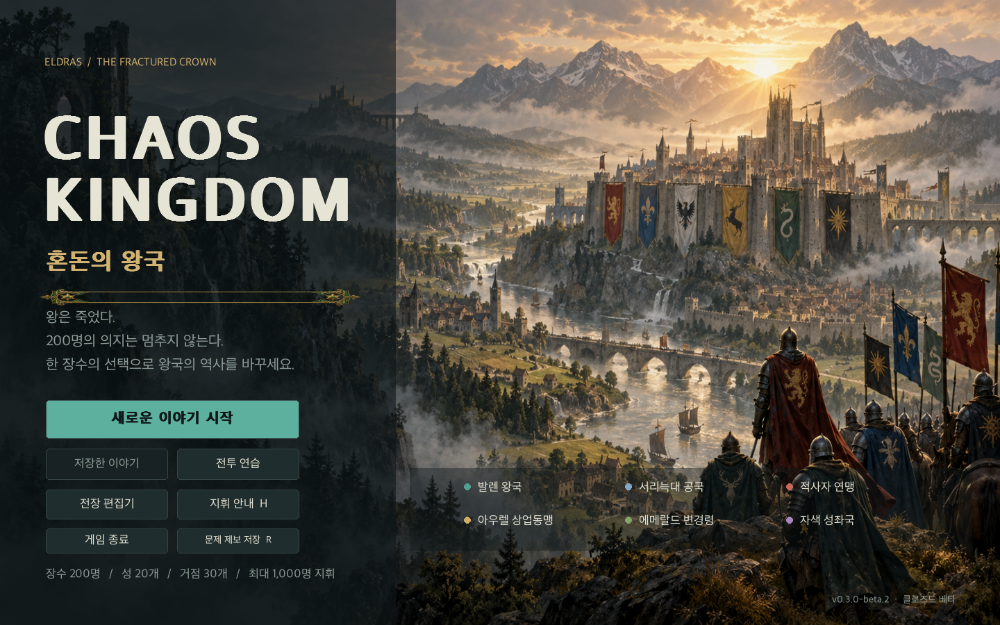
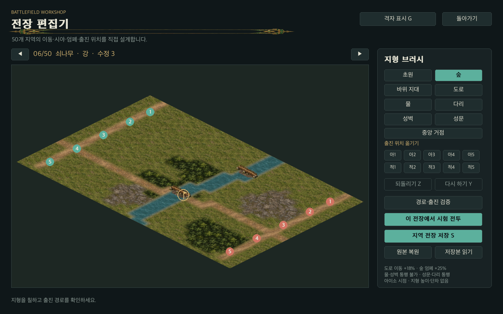

# 15장. GPT Image Generator로 게임 자산 만들기

## 그림의 용도부터 지정한다

베타에서는 Codex의 내장 GPT Image Generator를 실제로 호출해 자산을 제작했다. 타이틀 배경 한 장, 세계지도 한 장, 투명 UI 장식 한 장, 초상 시트 네 장, 전장 지형 시트 두 장이다. 이전 원본을 보존하고 새 평면 재질 시트를 적용했다. 이어 아이소 건축물과 병종 부대 시트를 각각 한 장 생성해 총 원본 자산은 11개다. 원본은 보존하고 게임용 사본을 `chaos_kingdom/assets/`에 두었다. 프롬프트와 원본 경로는 `manifest.json`에 기록했다. 내장 도구가 노출한 생성 도구 이름을 기록했으며 확인되지 않은 모델 버전이나 제작 비용을 붙이지 않았다.

처음에는 멋진 그림을 주문하는 문장보다 용도에 맞는 제약을 먼저 적었다. 타이틀은 왼쪽에 메뉴가 들어가므로 어둡고 조용한 공간을 요구했다. 세계지도는 50개 영지를 실시간으로 표시하므로 도시 이름·도로·소유 색을 넣지 않았다. 초상은 머리와 어깨가 각 칸 안에 들어가도록 했고, UI는 가운데가 투명한 장식만 요구했다.

OpenAI 공식 이미지 생성 문서는 생성과 기존 이미지의 편집을 다룬다. 이 개발에서는 별도 API 구현 대신 제공된 내장 도구를 사용했다. 게임 실행 시 이미지를 새로 생성하지 않으며, 제작된 PNG를 패키지에 포함한다. [OpenAI 이미지 생성 문서](https://developers.openai.com/api/docs/guides/image-generation)

## 하나의 스타일을 유지한다

엘드라스의 기본 팔레트는 짙은 에메랄드, 오래된 금색, 따뜻한 양피지다. 배경과 초상은 유화와 과슈를 섞은 회화적 표현을 요청했다. 실제 중세의 소재와 의복을 참고하는 가상 세계이며 기존 작품의 인물이나 역사 인물 얼굴을 지정하지 않았다. 각 세력의 색은 UI와 인물의 소속 표시에서 동적으로 관리한다. 초상 속 옷 색이 정치적 소속을 고정하지는 않는다.

그림에 한글 메뉴를 넣지 않은 것도 생산상의 선택이다. 버튼 이름, 병력, 연도와 소유자는 플레이 중 바뀐다. 생성 이미지에 이 정보를 굳혀 놓으면 번역과 해상도 변경 때마다 그림을 다시 만들어야 한다. 라이브 텍스트는 PyGame에서 그리면 글꼴·줄바꿈·말줄임을 코드에서 검증할 수 있다.

## 200개 얼굴을 주소로 관리한다

200번의 개별 생성 대신 50개 초상을 담는 시트 네 장을 요청했다. 게임은 `o000`부터 `o199`까지 장수 ID를 가진다. 명세에는 각 ID에 시트 번호와 칸 번호를 배정했고, 한 칸을 여러 장수가 공유하지 않도록 검사한다. 각 초상의 크기가 다른 화면에서도 같은 인물이 보이는 것이 핵심이다.

생성 결과는 요청한 10열을 항상 지키지 않았다. 첫 두 시트에는 오른쪽에 여분의 열이 생겼고, 마지막 시트는 11열이었다. 프롬프트가 정확한 데이터 구조를 보장한다고 가정하면 얼굴이 경계에서 잘린다. 실제 결과의 열 경계를 확인해 사용 영역을 지정하고, 화면에서 필요한 부분을 런타임 주소로 참조했다. 원본 파일을 덮어쓰거나 다시 칠하지 않았다.

이 과정에서 장수 이름과 얼굴의 인상을 함께 확인했고, 겉으로 보이는 연령에 맞게 가상의 인물 나이를 조정했다. 표정과 연령의 섬세한 연속성, 같은 인물의 여러 감정 표정은 후속 제작 범위다. 서로 다른 픽셀을 가진 200개 칸을 검사했다는 사실이 200개 캐릭터의 모든 예술적 개성을 보증하지는 않는다.

## 그림과 규칙의 지도를 구분한다

세계지도 그림은 연대기와 영지의 위치를 읽는 바탕이다. 전략 지도의 도로·영지·소유·현재 위치는 세계 모델을 읽어 그린다. 전장에서는 초원, 숲, 바위 지대, 도로, 물, 다리, 성벽의 타일 그림을 생성 시트에서 가져온다. 이동 가능 여부는 그림의 색을 분석하지 않고 JSON의 지형 코드로 판단한다.

이 선택은 에디터를 만들기 쉽게 한다. 바위 그림을 조금 더 거칠게 바꾸어도 바위 지대의 방어 효과는 바뀌지 않는다. 물을 다리로 바꾸면 코드가 바로 통행 가능 상태로 바꾸고 다리 그림을 표시한다. 그림과 판정이 서로 다른 데이터를 숨기지 않게 한다.

## 자산 검증과 편찬 기록

자산 검사는 파일 존재, 이미지 읽기, 초상 주소의 중복, PNG 투명도, 실제 화면 배치로 나누었다. 최종 확인은 실제 크기의 게임 화면을 다시 보는 것이다. 넓은 생성 결과에서는 괜찮던 얼굴이 112픽셀 초상에서 흐릿할 수 있고, 얇은 금색 장식이 한글 제목을 가릴 수 있다.

UI 장식은 생성된 투명 이미지의 실제 내용 경계를 읽어 메뉴의 구분선으로 배치했다. 그림이 정사각형 캔버스 가운데에 있어도 전체 캔버스를 얇게 눌러 사용하지 않는다. 콘텐츠 경계를 참조해 배치하는 문제와 원본 이미지를 수정하는 문제를 구분했다.

책의 제작 기록에는 프롬프트, 원본, 적용 화면, 실패한 제약과 보정 방법을 남긴다. 좋은 그림만 모으면 독자가 실제 제작에서 가장 자주 만나는 문제를 놓친다. 생성 결과를 사용 가능한 자산으로 만드는 과정까지가 아트 제작이다.

## 평면 재질 시트의 두 번째 제작

사용자가 원한 것은 산·땅·강이 자연스럽게 이어지는 전장이고, 추가 설명은 단차를 뜻하지 않는다는 것이었다. 새 프롬프트에는 높이차·절벽·계단·등고선·등각 투영을 넣지 않고 같은 평면에서 읽히는 재질을 요청했다. 기존 게임의 자산을 가져오지 않고, 지형 전환의 가독성을 참고한 새 그림을 만들었다.

새 원본 `terrain-v2.png`는 1774×887픽셀의 4열·2행 시트다. 위 행은 초원·숲·바위·흙길, 아래 행은 물·나무 다리·석벽·수변 자갈이다. 프롬프트 전문은 `docs/production/terrain-v2-prompt.txt`에, 원본 생성 경로·배치·SHA-256은 자산 명세에 남겼다. 그림은 런타임에서 해당 영역을 참조해 그린다. 생성 원본을 덧칠하거나 잘라 저장하지 않았다.

새 재질을 작은 칸마다 다시 시작하면 무늬와 경계가 반복된다. 그래서 전장 전체 좌표에 재질을 반복하고, 같은 지형의 칸을 묶은 마스크로 합성한다. 경계 마스크를 작게 축소한 뒤 확대해 모서리를 부드럽게 하고, 물 아래에는 자갈 띠를 먼저 그린다. 다리 밑에서도 강이 이어지게 물과 다리를 같은 수변 마스크로 취급한다. 이런 합성은 표시 작업이며 높이와 통행 판정을 추가하지 않는다.

현재 시트는 절차적으로 반복되므로 넓은 면에서 비슷한 무늬를 찾을 수 있다. 모든 방향을 위해 사람이 제작한 전환 타일 세트와 같은 완성도를 얻었다고 쓰지 않는다. 베타는 재질의 연속성과 판정의 일관성을 먼저 확보했고, 더 많은 재질 변형과 전환 전용 원화는 후속 미술 제작 후보로 남겼다.

## 성벽·성문·다리와 아이소 부대 시트

새 건축물 시트 `structures-isometric-v1.png`는 1774×887픽셀, 4열·2행이며 투명 알파를 가진다. 위 행은 두 방향의 성벽과 성문, 아래 행은 탑·두 방향의 나무 다리·성채다. 단차와 절벽을 요구하지 않고 2:1 평면 투영, 같은 조명, 같은 소재, 한 칸에 한 개체를 지정했다. 실제 배치가 각 셀에 들어오는지 원본과 게임 화면에서 확인했다.

첫 두 성벽이 같은 방향으로 나왔으므로 두 번째 셀을 읽을 때 런타임 좌우 반전을 적용했다. 이 보정은 `structures_layout.mirror_x`에 남긴다. 원본 PNG를 덧칠하거나 잘라 저장하지 않았다. 성채는 성곽의 뒤쪽 모서리 표시로 사용하고 성문과 다리의 통행은 그림과 별도의 지형 코드가 결정한다.

`units-isometric-v1.png`도 1774×887픽셀, 4열·2행의 투명 시트다. 보병·궁병·기병·창병의 두 방향을 담는다. 한 그림의 세 병사는 전술 단위의 상징이다. 게임의 병력은 숫자로 표시하고 소속 색·선택·사기·목표는 UI가 그린다. 요청과 달리 부대 아래 작은 바닥 조각도 생성됐다. 이를 그대로 보존해 사용하며 완전한 무바닥 병사 원화라고 쓰지 않는다.

설계 브리프는 `docs/production/isometric-structures-prompt.txt`, 실제 전송 프롬프트는 `isometric-structures-request.txt`와 `isometric-units-prompt.txt`, 실제 원본 경로와 SHA-256은 자산 명세에 있다. `imagegen` 스킬의 내장 도구를 실제 호출했으며 `superdesign`의 독립 자산 경로 지침은 참고했다. 스킬·도구·별도 에이전트 실행 여부의 구체적인 출처는 13장과 `workflow-tools.json`에서 관리한다.

