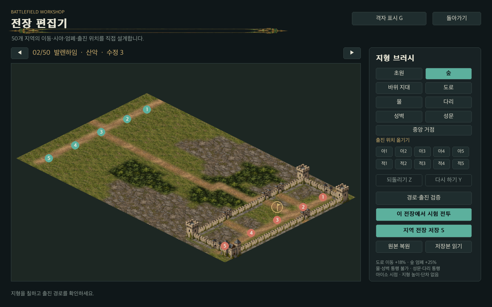

# 16장. 지역마다 다른 전장과 맵 에디터

## 같은 배경을 반복하지 않는다

초기 전투는 영지의 다섯 가지 지형 이름에 따라 배경을 조금 다르게 그리는 방식이었다. 베타는 50개 영지마다 별도의 32×20 지형 배열을 가진다. 평원과 숲, 산악·강·해안에서 나무 밀도, 바위 지대, 장벽, 강의 위치와 굽이, 다리와 주요 도로가 다르다. 지역별 기본 파일은 `data/battlefields/s00.json`부터 `s49.json`까지다.

세계 생성 시드가 바뀌면 장수 능력과 행동, 자원과 판세는 달라진다. 영지의 지형과 전장은 안정적으로 유지한다. 같은 성이 시나리오마다 산에서 강으로 바뀌는 혼란을 줄이고, 플레이어가 지리를 학습할 수 있게 한다. 50개의 배열이 서로 다르고 모든 출진 위치와 중앙 거점이 연결되는지 제작 도구로 검사한다.

## 전장을 설명하는 데이터

| 필드 | 내용 | 검증 조건 |
| --- | --- | --- |
| schema | 전장 형식 버전 | 현재 1 |
| region | 전략 지도의 지역 ID | s00~s49 |
| tiles | 20행, 각 행 32칸 | 등록된 지형 코드만 사용 |
| spawns | 공격·수비 각 5개 좌표 | 중복 없이 통행 가능 |
| objective | 중앙 거점 좌표 | 모든 출진 위치와 연결 |
| revision | 저장한 편집본의 수정 번호 | 제보와 편집 이력 구분 |

지형 코드는 초원 `.`, 숲 `f`, 바위 지대 `h`, 도로 `r`, 물 `w`, 다리 `b`, 성벽 `#`, 성문 `g`이다. 물과 성벽은 통행 불가다. 다리는 물 위의 연결을 만들고, 도로는 이동 속도를 18% 높인다. 숲은 이동을 늦추고 방어를 25% 높이며, 바위 지대는 이동을 늦추고 방어를 20% 높인다. 깊은 숲과 성벽은 시야를 막는다.

## 경로를 계산한다

전투의 좌표는 100×60 단위다. 이를 타일 칸으로 바꾸고 A*로 경로를 구한다. 인접한 네 방향만 사용하므로 막힌 모서리를 대각선으로 뚫지 않는다. 비용은 지형 속도의 역수다. 휴리스틱은 맨해튼 거리를 가장 빠른 도로 속도로 나누어 실제 비용을 과대평가하지 않도록 했다.

지도 한 장에서 자주 반복되는 출발·목표 칸의 경로는 캐시한다. 지형을 칠하거나 복원하면 캐시를 비운다. 목표가 이동한 부대는 새 경로를 구한다. 통행 가능한 칸이라도 다른 섬에 있어 경로가 없으면 부대는 정지한다. 가까운 좌표를 찾았다는 이유만으로 물을 가로질러 움직이지 않는다.

현재는 활동 부대 중심의 겹침을 완화하는 국소 회피를 사용한다. 집단 명령은 목적지 칸을 나눠 배정하고, 밀림과 이동 선분의 모든 칸을 검사한다. A* 경로가 연결되어 있어도 경로 중심에서 비켜 난 부대가 다음 지점으로 직진하면 성문 모서리를 자를 수 있다. 이런 경우 현재 칸 중심으로 돌아온 뒤 다음 경로를 따른다. 개별 병사의 정밀 충돌·대형·진로 예약은 후속 범위다.

## 편집기의 작업 흐름

메인 메뉴의 전장 편집기를 열면 50개 지역을 순서대로 고를 수 있다. 좌클릭과 드래그는 칠하기, 우클릭은 지형 선택이다. 출진 위치 버튼을 누르고 원하는 칸을 클릭하면 부대의 초기 위치를 옮긴다. 중앙 거점도 같은 방식으로 이동한다. 한 번의 드래그를 하나의 되돌리기 작업으로 묶고 최대 64개 작업을 보관한다.

저장과 시험 전투 앞에는 검증이 있다. 출진 칸에 성벽을 칠하거나 모든 다리를 없애면 저장을 거부하고 이유를 보여 준다. 편집 중에는 이런 임시 상태를 허용한다. 그 상태조차 만들지 못하게 하면 큰 지형을 수정하기 불편하기 때문이다. 검증 시점은 사용자가 작업 중인 순간과 전투에 적용하는 순간 사이에 둔다.

시험 전투는 편집 중인 지형을 바로 사용하며 캠페인의 세계를 바꾸지 않는다. 전투를 마치면 편집기로 돌아오고 미저장 작업도 유지된다. 지역 전장 저장은 사용자 저장 폴더 아래의 `battlefields`에 기록한다. 기본 패키지의 파일은 남아 있으므로 원본 복원과 저장본 읽기를 구분할 수 있다. 미저장 작업이 있을 때 지역을 바꾸거나 메뉴로 나가면 게임 안에서 작업을 버릴지 확인한다.

## 편집기까지 재현 자료에 넣는다

다른 PC에서 문제를 재현할 때 세계의 시드만으로 충분하지 않을 수 있다. 사용자가 전장을 바꾸었다면 다리와 출진 위치가 달라진다. 베타 제보 묶음에는 실제 사용 가능한 50개 전장 파일과 현재 전투의 지형 스냅샷을 포함한다. 과거에 저장한 전투는 에디터를 나중에 수정해도 그 전투의 원래 지형으로 이어간다.

전장 편집기는 그래픽 도구이면서 게임 규칙을 시험하는 도구다. 같은 편성에서 다리를 하나와 둘로 바꾸고 이동 시간·손실·거점 확보를 비교하면 전투 설계의 효과를 읽을 수 있다. 지형 제작과 밸런스 실험을 한 프로그램 안에서 연결한 이유가 여기에 있다.

## 단차 없이 자연스러운 지형을 만드는 방법

초기 기본 전장은 각 칸의 난수로 숲과 바위를 따로 배치해 바둑판처럼 보이는 곳이 많았다. 새 기본 배치는 숲과 바위를 여러 개의 불규칙한 타원 덩어리로 만들고, 길은 완만하게 휘면서 네 방향 연결을 유지한다. 강은 위아래로 이어지고 주 도로가 물을 만나는 칸은 다리가 된다. 산악 전장의 바위 지대를 긴 성벽으로 표현하던 배치는 짧은 인공 벽·유적으로 바꿨다.

`h`는 저장 호환을 위해 유지한 코드다. 표시 이름은 바위 지대이고 방어 20%는 돌을 이용한 엄폐다. 높이 필드, 고저차 피해, 절벽과 경사로 규칙은 없다. 지역 분류의 산악은 바위가 많이 분포한 전장이라는 의미다. 지형 배열을 읽는 이동·시야·엄폐 판정과 화면의 부드러운 경계를 구분한다.

`BattlefieldRenderer`가 전장 배열과 표시 크기를 키로 합성 화면을 캐시한다. 칠한 배열이 바뀌면 새 그림을 만들고, 되돌리면 같은 배열의 그림을 사용한다. 최대 12개 화면만 유지한다. 별도의 표시 마스크를 흐리므로 모서리의 일부 픽셀은 섞여 보이지만 실제 통행은 32×20칸 기준이다. 편집기에서 G키나 격자 버튼을 켜면 판정 칸을 확인할 수 있다. 기본 보기는 격자를 숨겨 실제 전장과 같은 질감을 보여 준다.

평면 재질 개선 당시 기본 배치의 `revision`은 2였고 `schema`는 계속 1이다. `tools/generate_battlefields.py`는 지역 ID별 고정 시드로 패키지 기본 전장 50개만 재생성한다. 사용자 저장 폴더의 편집본은 수정하지 않는다. 이전 베타에서 실제 사용한 revision 1 파일은 `docs/examples/battlefield-v1.json`에 남겼고, 그 지형을 가진 전투 스냅샷을 현재 기본 배치로 대체하지 않는 자동 검사도 추가했다.

표시가 자연스러워졌다는 이유만으로 전투 결과가 같다고 가정하지 않았다. 재질만 변경하면 판정은 그대로지만 이번에는 숲·바위·길의 배치도 바꿨다. 따라서 50개 지역 전투와 세 시드의 480주 역사를 다시 실행했다. 전후 보고서는 `terrain-previous-audit.json`과 `beta-audit.json`이며 최종 수치는 17장과 검증 기록에 적는다.

## 아이소 편집과 성문을 추가하다

0.3 기본 전장은 revision 3, 형식은 schema 1이다. 성 20곳에는 성벽과 통행 가능한 성문으로 둘러싼 수비 구역을 만들고 거점을 안쪽에 배치했다. 거점 30곳은 기존 지역별 숲·바위·도로·강과 다리를 유지한다. 지역 ID별 고정 난수와 50개 고유 배치를 유지하며 사용자 편집본은 덮어쓰지 않는다. 이전 저장의 전장 스냅샷도 새 기본 지도로 교체하지 않는다.

편집기는 전투와 같은 아이소 시점이다. 마우스 위치를 `IsometricProjection.cell_at`으로 역변환한다. 직사각형 패널 안이더라도 다이아몬드 밖을 클릭하면 아무 칸도 칠하지 않는다. 모든 640칸 중심이 표시·역변환 왕복에서 원래 칸으로 돌아오는지 두 화면 크기에서 검사했다. 성문 브러시를 추가하고 지형 버튼과 중앙 거점·출진 위치 버튼이 겹치지 않도록 배치했다.

